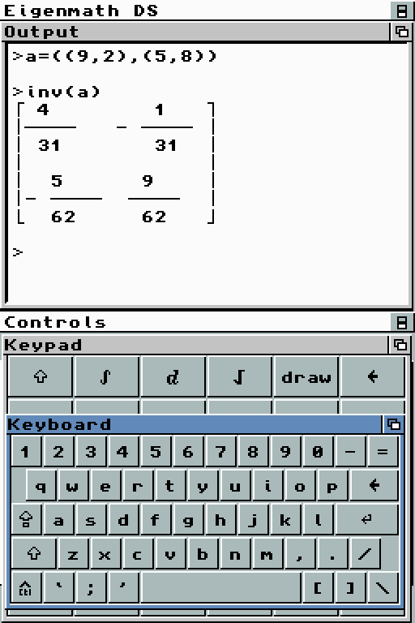

# Eigenmath DS 1.1 version

## Introduction

The aim of this project is to have a portable free CAS comparable to commercial
systems such as Texas Instruments or HP calculators.

Download the latest version [here](https://github.com/AntonioND/eigenmathds).



## Instructions

- Terminal output mode:

  - A: Eval math sentences.
  - B: Swap otput window to graph window and back.
  - Y: Swap otput window to edit script window and back, when button Y is
    pressed again, the sentences in script window are ready to use in the otput
    mode.
  - X: Flip screens
  - START: Text zoom is raised. Press again to back to normal font size.
  - Up: Scroll up otput window.
  - Down: Scroll down otput window.
  - Left: Previous history commands.
  - Right: Next history commands.

- Script edit mode:

  - Up, Down, Left, Right: Move cursor.

## Recommendations

If the results are too big to display in normal font size, press START or try
the tty terminal mode.

For a large formula or a big matrix use the script mode, is less tedious correct
the values.

The command clear clears all previous operations, asignations, results and it
clears the graph area except for the script mode.

There are two ways to use draw button:

    draw(sin(x))
    enter

or

    sin(x)
    draw
    enter

Remember there are special funtions for matrix operations: `dot`, `inv`...

## Build

Install [BlocksDS](https://blocksds.skylyrac.net/docs/).

Run this in the root of this repository:

```bash
make -j`nproc`
```

## License

Copyright (c) 2008-2009, Leonel Hernandez
All rights reserved.

leonelhs@gmail.com

http://eigenmatds.sourceforge.net

http://eigenmathds.wordpress.com

This program is free software; you can redistribute it and/or modify
it under the terms of the GNU General Public License as published by
the Free Software Foundation; either version 3 of the License, or
(at your option) any later version.

THIS SOFTWARE IS PROVIDED BY LEONEL HERNANDEZ ``AS IS'' AND ANY
EXPRESS OR IMPLIED WARRANTIES, INCLUDING, BUT NOT LIMITED TO, THE IMPLIED
WARRANTIES OF MERCHANTABILITY AND FITNESS FOR A PARTICULAR PURPOSE ARE
DISCLAIMED. IN NO EVENT SHALL Leonel Hernandez BE LIABLE FOR ANY
DIRECT, INDIRECT, INCIDENTAL, SPECIAL, EXEMPLARY, OR CONSEQUENTIAL DAMAGES
(INCLUDING, BUT NOT LIMITED TO, PROCUREMENT OF SUBSTITUTE GOODS OR SERVICES;
LOSS OF USE, DATA, OR PROFITS; OR BUSINESS INTERRUPTION) HOWEVER CAUSED AND
ON ANY THEORY OF LIABILITY, WHETHER IN CONTRACT, STRICT LIABILITY, OR TORT
(INCLUDING NEGLIGENCE OR OTHERWISE) ARISING IN ANY WAY OUT OF THE USE OF THIS
SOFTWARE, EVEN IF ADVISED OF THE POSSIBILITY OF SUCH DAMAGE.

## Changelog

- Version 1.1:

  - Port to BlocksDS.

- Version 1.0:

  - Support for math function graphs.
  - Script mode.
  - Text zoom.
  - Natural result display.
  - Functions menu.

## Credits

The application was ported from the original source code written by George
Weigt.

Eigenmath DS was ported to Nintendo DS by Leonel Hernandez (leonelhs@gmail.com)

The GUI is made with the 0.36 version of Woopsi  with some patches specific to
Eigenmath DS. The source code can be found in the folder `source/woopsi`.
